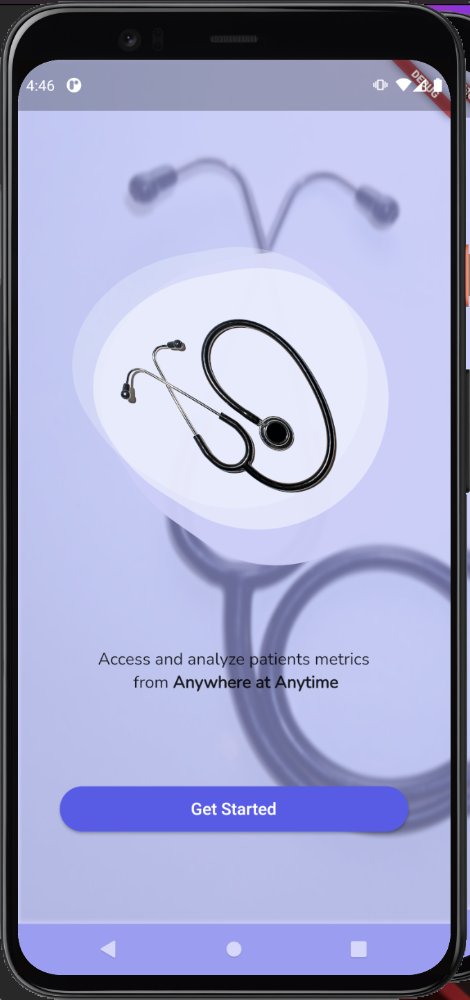
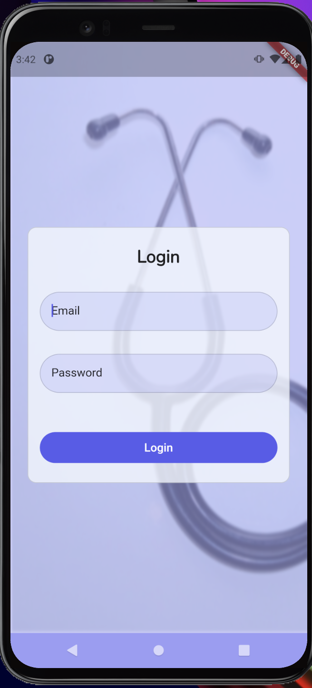
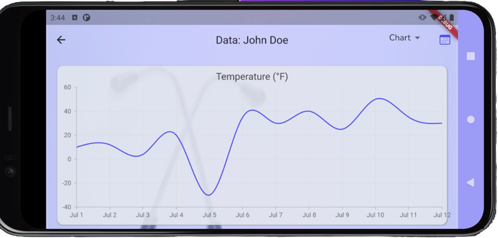
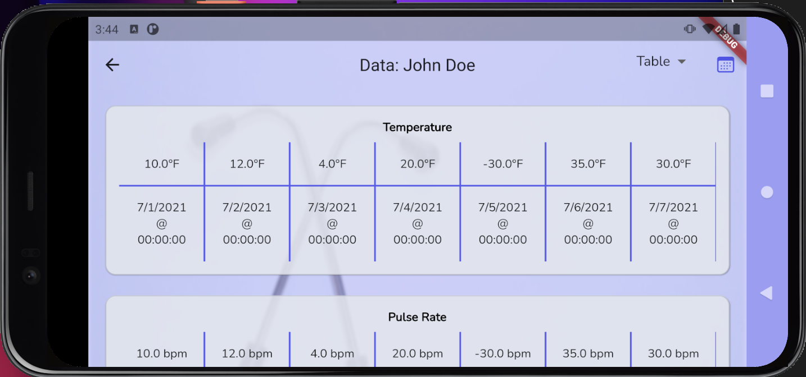
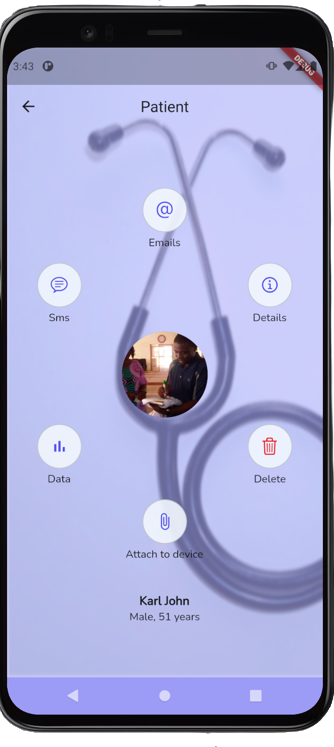

# VPTrics

VPTrics is short for Patient Vital  Metrics, A remote patient monitoring system where authorized doctors can monitor the Temperature, Pulse, and other patients' data in real-time from the Android or iOS application.  Doctors can also send emails and SMS to patients using the mobile application.

## Environment
## Setting up
* **fvm @ latest**
* **Flutter @ 2.0.3**
* **Dart @2.12.2**

Clone the project to your computer and run `flutter pub get` **Ensure that fvm is globally installed on your computer**
Check [how to install fvm](https://fvm.app/docs/getting_started/installation) if you don't have it configured on your computer.

## Development build

Connect an emulator and run `fvm flutter run` 

## Snapshots of the app in action

### Onboarding Page

### Login Page

### Graph of patient data

### Table of patient data

### Patient dashboard

